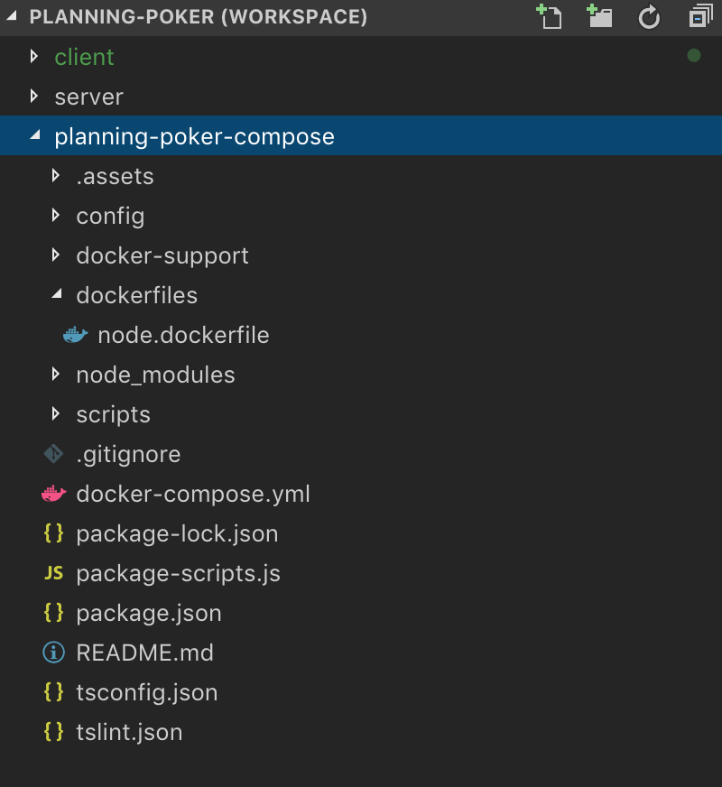

# Planning Poker Compose

## Purpose
This repository serves as a single point to work with the Planning Poker project.  As a part of running `npm install`, it will automatically clone the dependent projects into the same directory that this project is cloned into, alongside it.

## Prerequisites
* Node LTS ([download](https://nodejs.org/en/download/))
* Docker ([download](https://www.docker.com/get-started))

## Quickstart

### Dependency installation
To install the dependencies and clone the requisite container projects, run:
```bash
$ npm install
```

### Starting the containers
To generate a `docker-compose.yml` file and spin up all of the containers using `docker-compose up`, run:
```bash
$ npm start
```

If you wish instead to run the apps in a detached process, you can run:
```bash
$ npm start detached
```

Once the containers are running, this will also attempt to open a browser window to the application.

In addition, once the `docker-compose.yml` file is generated, you can use the `docker-compose` command with [its CLI](https://docs.docker.com/compose/reference/overview/)

### Interactive scripts
To view all available scripts, run:
```bash
$ npm run interactive
```

## Containers
* `server`
  * A graphql server built using `apollo-server`.
  * To explore the graphql schema using the browser IDE, you can go to: `http://localhost:3001`.
  * Code lives in the `server` directory next to this one, once cloned.
* `client`
  * A react application that talks to the backend using `react-apollo`.
  * Code lives in the `client` directory next to this one, once cloned.
* `proxy`
  * An nginx server used to route requests to the client and server.
  * Runs on port 80, so that the app can be seen at `http://localhost/`.
  * The `nginx.conf` lives in docker-support.
* `database`
  * A `mongodb` database only available to the `server` container.
  * Does **not** expose a public port; only available on the `db` docker-compose network.

### More info & development
For more information about how to develop the container applications, you can see the readme's for:
* `server` - [planning-poker-server](https://github.com/excellalabs/planning-poker-server)
* `client` - [planning-poker-client](https://github.com/excellalabs/planning-poker-client)

If you want to use the [GraphQL for VSCode](https://marketplace.visualstudio.com/items?itemName=kumar-harsh.graphql-for-vscode#overview) plugin, and you want to have a multi-folder workspace, ensure that the `client` project is the first folder in the workspace.  It should look something like this:


